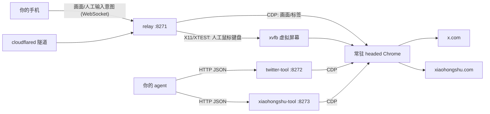

# 给你的 agent 一个能刷社交平台的浏览器

从零开始,搭一台**人和 AI 共用的常驻浏览器**:你用手机遥控它注册登录、养号、过验证码;你的 agent 通过几个 HTTP 动作用它刷推特/小红书,拿到的是结构化 JSON。全程复用同一份真实登录态——不导出 cookie、不存密码、不给 agent 碰凭据。

最重要的一件事先说:**这套方案能活,靠的是「headed(带界面)的真 Chrome + 一份人登录出来、长期养着的真实 cookie」——不是遥控,也不是任何自动化技巧。**下面第一节就讲这个,动手前务必看,别把力气花错地方。

一个前提先说清:**你得已经有一个会调 HTTP 工具的 agent**(Claude Code、任何能执行 curl 的 agent 框架都算)。本指南不教怎么搭 agent——连 agent 都还没有的话,先别急着让 AI 刷社交平台。

仓库就两块积木:

| 目录 | 是什么 | 详细文档 |
|---|---|---|
| [`relay/`](relay/README.md) | 常驻 headed Chrome + 手机遥控:画面推流到手机,触摸/键盘打回去。核心资产(那份真实登录态)养在这里,遥控是维护它的通道 | 含风控定位、安全模型、踩坑史 |
| [`actions/`](actions/README.md) | 把刷推特/小红书包成 `feed / read / like / reply / post` 这样的动词,HTTP 服务。agent 只拿动词,不拿浏览器 | 含动作参考(就是喂给 agent 的工具说明)、踩坑史 |



## 核心是浏览器和登录态,不是遥控

这套东西真正值钱的是两样,价值排序想清楚再动手:

**1. headed(带界面)的真 Chrome。** 无头浏览器有一堆藏不住的破绽:`navigator.webdriver` 标志、UA 里带 Headless、缺插件、WebGL / 字体渲染和真机对不上。风控不用看你干了什么,光看指纹就能把无头爬虫筛出去——很多"脚本一动就被盯上"的账,其实第一笔就记在无头浏览器头上。本项目跑的是**带界面的真 Chrome**(服务器上用 xvfb 撑一块虚拟屏幕),在网站眼里,这是一台普通电脑上开着的普通浏览器。

**2. 一份人登录出来、长期养着的真实登录态。** 登录永远由人在浏览器里完成——验证码、短信、扫码都是人做的,cookie 是网站正常发给一个真实登录会话的,不是导出来再塞进去的嫁接货。之后 cookie、历史、本地存储全在这份 profile 里连续地长,平时人还偶尔拿它刷两下。在网站眼里这是"一个老用户自己的浏览器",**这份连续性比任何伪装手段都值钱**。反过来对照一下常见的"无头浏览器 + 导入 cookie"方案:指纹是爬虫的,登录态是嫁接的,两头不占,死得快不冤。

那 relay(手机遥控)是什么角色?**是维护上面第 2 样资产最顺手的通道,不是魔法。**没有它,你 VNC / ssh 转发进去也能登录,只是难受。relay 做的事,是让"人在这个浏览器里登录、过验证码、撞墙时接管一下"变成掏出手机点两下的事,从而让那份登录态长期成立。日常跑起来之后你会发现 relay 打开的次数并不多——它安静,恰恰说明根基是稳的。

所以:**headed 真浏览器 + 真实登录态是根基,动作服务是接口,relay 是维护根基的通道。**风控层面的诚实预期(它不能让你隐身,只是比纯自动化稳一点)见 [`relay/README.md`](relay/README.md) 的风控定位一章。

## 但比这一切都重要的是:把号养好

上面讲的 headed、真实登录态、甚至下面要说的改 Playwright,全是技术手段。但真话是:**账号本身养得好不好,比任何技术方案都重要。**同样一套代码,结局主要取决于你喂进去的是个什么号。

- **风控因号而异,不是因方案而异。** 一个养了很久、平时有人真人在刷的老小号,容差高得多,偶尔自动化几下根本不进法眼;一个**刚注册、立刻从机房 IP 登录、立刻挂自动化**的号,你把 Playwright 调得再像人、relay 接管得再勤,也是重点盯防对象——它身上每一条信号都写着"新号 + 数据中心 + 机器节奏"。
- **人手养几天是硬门槛,绕不过去。** 新号注册完别急着上自动化。当正常用户用几天:刷首页、点几个赞、关注几个人、发一两条普通内容。风控看的是"这个号有没有一段像人的历史",这段历史只能靠人一天天攒,没有捷径。
- **让 IP 也成为"老地方"。** 自动化最终是从服务器那台机房 IP 出去的。为了别让这个 IP 对账号来说是"第一次见",最好在养号阶段就**让手机 App 也挂上同一个落地机房的 IP,偶尔真人刷两下**——这样等自动化真跑起来,这个数据中心 IP 在账号的历史里早就是个熟面孔,而不是突然冒出来的异常登录地点。

一句话:**养号 > 一切。**代码是这套东西里最不值得担心的部分,号才是。

### 想更进一步:自己改 Playwright(可选,且次要)

号养好之后,如果确实观察到脚本动作触发风控,还想让脚本那头更稳,可以自己动手改——**没有触发问题时不要为了“像人”而堆随机动作。**它排在养号后面,不是替代品。脚本容易被盯上时,常见差别是两样:**节奏**和**捷径**,而这两样都在你自己的动作代码里,`actions/` 全是开源的 Playwright,想改就改:

- **节奏**:动作之间加随机停顿、别匀速连点;先滑两下、停一下再操作,别一上来就精准命中目标。
- **捷径**:用真实的按键 / 聚焦 / 滚动事件代替"直接把值塞进输入框";别让目标元素瞬间跳到眼前、别注入 JS、别直接 `goto` 跳 URL——把人操作时那串自然事件补回去。

做到位能实打实降低撞墙频率。但同样一句提醒:**这只让脚本那头不那么扎眼,改变不了根基。**再像人的脚本,跑在一个新号 / 无头浏览器 / 嫁接 cookie 上,一样活不长。relay 文档的风控定位一章把"节奏 / 捷径"这两处差别拆得更细,是很好的改造清单。

## ⚠️ 先读这五条(安全与风险)

1. **必须用专门小号,绝不能拿主号。** 自动化操作违反 X / 小红书的服务条款,有封号风险,后果自负。
2. **CDP 端口(9333)绝不能出 `127.0.0.1`。** 它没有任何鉴权,谁碰到它,谁就拥有浏览器里一切网站的登录态。
3. **动作服务(8272/8273)没有鉴权,只绑回环或内网。** 谁能访问端口,谁就能用你的账号发推。跨机器调用要套带鉴权的反代或走内网。
4. **relay(8271)不裸暴露公网。** 走 cloudflare tunnel 之类的隧道加 TLS,密码必须强——登录没有防爆破,这道门就是全部。
5. **频率闸的默认值故意很小**(每小时发帖 ≤5、互动 ≤20)。这套东西是给"个人 agent 顺手刷刷"设计的,不做多账号、不做代理池、不做验证码破解——那些是刷量工具的需求,不是本项目的。

## 全流程

### Step 0 — 给 AI 开个专号

正常用手机注册一个 x.com / 小红书小号,和平时注册没有任何区别。两个理由必须专号:一是封号风险隔离,二是 agent 能看到这个账号的一切,别把主号的私信、关注关系喂进去。

新号别注册完立刻挂自动化。先当正常用户手动刷几天——风控看的是行为,一个刚出生就 API 节奏刷屏的号,和一个人手养过几天的号,待遇不一样。这一步是整套方案里最重要、也最没有捷径的一步,别省(为什么这么关键,见上面「把号养好」一节)。有条件的话,养号阶段就让手机 App 挂上服务器那台落地机房的 IP 偶尔刷一下,让这个 IP 提前成为账号眼里的老地方。

### Step 1 — 起 relay(那台常驻浏览器)

在 VPS 上部署(2GB 内存的小机实测够用;本地 Linux 想先试跑,或需要了解 macOS 当前限制,见 [`relay/README.md`](relay/README.md) 的快速开始):

```bash
# 1. 依赖:xvfb + X11/XTEST 运行库 + Chrome(chromium 也行)
sudo apt install -y xvfb libx11-6 libxtst6
# google-chrome-stable 按官方源装,或 apt install chromium-browser

# 2. 代码 + venv
sudo mkdir -p /opt/ai-social-browser && sudo chown $USER /opt/ai-social-browser
git clone https://github.com/blueberriely/ai-social-browser /opt/ai-social-browser
cd /opt/ai-social-browser/relay
python3 -m venv venv && venv/bin/pip install -r requirements.txt

# 3. 配置(务必设强密码)
sudo cp .env.example /etc/browser-relay.env && sudo vim /etc/browser-relay.env

# 4. systemd(unit 里的 User 和路径按你的实际情况改)
sudo cp deploy/browser-relay.service /etc/systemd/system/
sudo mkdir -p /etc/systemd/system/browser-relay.service.d
sudo cp deploy/resource-limits.conf /etc/systemd/system/browser-relay.service.d/
sudo systemctl daemon-reload && sudo systemctl enable --now browser-relay
```

公网入口交给隧道,8271 永远只绑 `127.0.0.1`:

```yaml
# cloudflared config.yml
tunnel: <tunnel-id>
credentials-file: /etc/cloudflared/<tunnel-id>.json
ingress:
  - hostname: browser.example.com
    service: http://127.0.0.1:8271
  - service: http_status:404
```

跑的时候建议 `cloudflared tunnel run --protocol http2`(实测比默认的 QUIC 在部分 VPS 网络上更稳)。

小内存机器强烈建议再装一层内存守护(内存快见底时牺牲浏览器保全机器),见 [`relay/README.md`](relay/README.md) 的内存守护章节。

### Step 2 — 手机连上,人工登录

手机浏览器打开 `https://browser.example.com`,输一次密码,30 天免登录。你现在看到的就是服务器上那个 Chrome 的画面,点按、滚动、打字都行。

Linux/VPS 上这些人手操作会进入 X11/XTEST，成为 Chrome 收到的操作系统级鼠标/键盘事件；画面、标签页和 viewport 仍由 CDP 管理，agent 的 Playwright 也仍走 CDP。两条输入路径共享同一个 Chrome 和 profile，但不会混成同一种操作来源。

在里面登录 x.com 和小红书。**所有验证码、短信、扫码,都在这一步由人做掉**——这正是整套方案不碰 cookie 导出、不存密码的原因:登录这件事永远由人在浏览器里完成。登录态从此养在服务器的 Chrome profile 里,换手机换电脑都不丢。

**这一步产出的就是整套方案最值钱的资产:一份由人登录出来的真实登录态。**后面 agent 的一切动作,都是在消费这份资产。

平时偶尔拿它当普通浏览器刷两下也行,人的使用痕迹本身就是养号的一部分。

### Step 3 — 起动作服务

```bash
cd /opt/ai-social-browser/actions
python3 -m venv venv && venv/bin/pip install -r requirements.txt
# 不需要 playwright install:只连现成浏览器,不下载/启动自己的浏览器
```

先手动跑通、冒烟:

```bash
cd twitter-tool
../venv/bin/uvicorn app:app --host 127.0.0.1 --port 8272 &

curl -s localhost:8272/health
# {"ok": true, "tabs": ..., "owned_pages": 0, ...}

curl -s localhost:8272/twitter -X POST -H 'content-type: application/json' \
  -d '{"action":"feed","n":5}'
# 应该返回你时间线上的 5 条推文,结构化 JSON
```

小红书同理(`xiaohongshu-tool` 目录,端点 `POST /xiaohongshu`)。冒烟通过后转 systemd 长期跑:

```bash
sudo cp /opt/ai-social-browser/actions/systemd/*.service /etc/systemd/system/
# 改 unit 里的 YOUR_USER 和路径
sudo systemctl daemon-reload && sudo systemctl enable --now twitter-tool xiaohongshu-tool
```

### Step 4 — 接上你的 agent

到这一步,接线只剩一段话的事:**把 [`actions/README.md`](actions/README.md) 里「twitter-tool 动作参考」和「xiaohongshu-tool 动作参考」两章原样贴进你 agent 的工具说明**(系统提示、CLAUDE.md、tool description,随你的框架),再告诉它服务地址。agent 会发 HTTP 请求就够了:

```bash
curl -s localhost:8272/twitter -X POST -H 'content-type: application/json' \
  -d '{"action":"like","url":"https://x.com/.../status/..."}'
```

有一条务必一起喂给 agent:**写动作返回 `uncertain` 时禁止自动重试**,那表示"可能已经发出去但没验证上",重试就是重复发帖。三态设计的完整说明在 actions 文档里。

### Step 5 — 撞墙了,人来接管(兜底,不是日常)

agent 迟早会撞上验证码、滑块、"异常登录"二次确认、或者干脆掉登录。这时候不用改任何代码:**掏出手机,打开 relay,你看到的就是 agent 卡住的那个页面,手动把它点过去,agent 接着跑。**同一个浏览器、同一个会话,只是操作的人换了一下——把风险最高的几步交给人,是这套方案对风控唯一诚实的答案(它不能让你隐身,细节见 relay 文档里的风控定位)。

正常情况下这一步很少用到:headed 真浏览器 + 养好的登录态本身就把大多数风控挡在了前面,relay 平时安安静静躺着就好。

症状对照(掉登录/超时/频率闸/uncertain 分别怎么处理),见 [`actions/README.md`](actions/README.md) 的失败路径速查表。

## 现实预期

- **内存是最紧的资源。** 2GB 小机跑得动,但 Chrome 同时开两个社交平台页面就已经很紧张,再多就卡。动作服务默认掐掉图片/媒体加载省内存,资源红线和内存守护把"最坏情况"控制在浏览器重启 30 秒,不会拖死机器。
- 别拿它当日常主力浏览器。顺手刷刷可以,重度浏览它会卡给你看。
- 页面选择器绑的是 2026-07 的站点结构,平台改版后读动作会以"等待超时"的形式明确失败,不会静默返回错数据。

## relay 顺手还能干嘛

它本身是个独立成立的东西:一台养在服务器上的"手机云浏览器"——访问只有服务器可达的内网服务、把重网页的 CPU/流量开销扔给服务器、登录态跨设备共用。细节见 [`relay/README.md`](relay/README.md)。

## License

MIT
