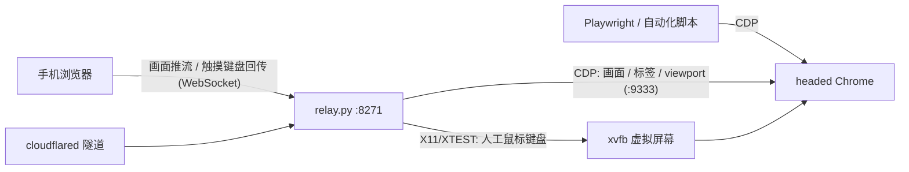

# relay —— 常驻浏览器 + 手机遥控

> 本目录是整个仓库的浏览器底座。想要"从零到 agent 刷起来"的完整部署流程，看[仓库根 README](../README.md)；这里是 relay 自身的完整文档。

在一台机器上跑一个**真正带界面的 Chrome**，手机浏览器就是它的屏幕和触摸板；同一个浏览器同时开放 CDP 端口给 Playwright 等自动化工具——**人和脚本共用同一个现场、同一份登录态**。

单文件 Python（约 1000 行）+ 两个静态页面，Python 依赖只有 `websockets`；Linux 人工输入直接调用系统已有的 `libX11` / `libXtst`。没有 Docker、没有前端构建、没有数据库。

## 为什么要这个东西

- **自动化卡壳时人来接力**：脚本跑一半撞上验证码 / 扫码登录 / 风控弹窗，掏出手机点一下，脚本接着跑。反过来也一样——你手动登录一次，之后所有自动化都带着这份登录态。
- **登录态养在服务器上**：cookie 存在服务器的 Chrome profile 里，换手机、换电脑都不用重新登录。
- **手机上的"云浏览器"**：访问只有服务器可达的内网服务；或者单纯把重网页的 CPU/流量开销扔给服务器，手机只收 jpeg 流。

## 为什么是 headed 浏览器 + 人工接管

一句话定位：**同样的操作，让脚本纯自动去点容易被网站风控盯上，让真人在同一个浏览器上手动接管一下，往往会稳一点。** 别指望它把风控变透明——只是比纯自动化好一些。两点原因：

**1. headed 真浏览器的指纹更像真人。** 无头浏览器有一堆藏不住的破绽——`navigator.webdriver` 标志、缺插件、WebGL / 字体渲染和真机对不上、UA 里带 Headless。本项目跑的是**带界面的真 Chrome**（服务器上靠 xvfb 撑一块虚拟屏幕），用一份**长期养着的 profile**（cookie、历史、登录态都在），并关掉了 `AutomationControlled` 标志。在网站眼里，这更接近"一个老用户在自己电脑上开的 Chrome"，而不是刚冒出来的无头爬虫。

**2. 同一个浏览器，只是换了操作的人——风控打的其实是"行为"。** 这里有个反直觉但很实在的点：手机遥控和 Playwright 可以驱动**同一个** Chrome，指纹、IP、登录态都一样；区别在于手机端的人手操作走 Linux 的 X11/XTEST 鼠标键盘事件，而 Playwright 仍走 CDP。除此之外还有两处行为差别：一是**节奏**——人会停顿、会先滑两下看看、时机是乱的，脚本是动作贴动作、又匀又快；二是**捷径**——脚本爱直接把值塞进输入框、让元素跳到眼前、注入 JS 或直接跳 URL，把人操作时那串自然的按键、聚焦、滚动事件全跳过了。所以撞上滑块、验证码、短信验证、异常登录二次确认时，掏出手机在同一个会话里手动过一遍，比让脚本硬闯稳。

> 一句实话别误会：Linux/VPS 上的点按、滚轮和键盘现在由 X11/XTEST 注入，页面收到的是操作系统级的可信鼠标/键盘事件；但它仍不是物理手机触屏，也不会凭空抹掉 VPS/IP、图形环境或 Playwright/CDP 本身的其他信号。正确姿势仍是：**能自动就自动，撞墙了人接一下**，把风险最高的那几步交给人。

## 架构



工作原理一句话：relay 用 CDP 的 `Page.startScreencast` 把页面帧拿出来推给手机；手机的触摸、滚动和键盘意图经 WebSocket 回传后，在 Linux 上转成 X11/XTEST 鼠标键盘事件。CDP 仍负责画面、标签切换和 viewport，但不再承载人手的 `Input.dispatch*`。手机端是一个纯静态页面，密码登录后即用，无需装任何 App。

支持：点按、滚动、软键盘输入、地址栏、前进后退刷新、**多标签页切换**、横竖屏自适应。

## 快速开始（本地）

```bash
pip3 install websockets
BROWSER_RELAY_PASS=你的密码 python3 relay.py
# 或用 ./start.sh 后台跑，./stop.sh 停
```

Linux 桌面环境直接可用；无桌面的 VPS 用 xvfb。Ubuntu/Debian 需要 `xvfb`、`libx11-6`、`libxtst6`（Chrome 通常已经带来后两项依赖）：

```bash
sudo apt install -y xvfb libx11-6 libxtst6
```

代码仍会探测 macOS Chrome 并推送画面，但当前原生人工输入后端只实现了 Linux X11；macOS 上手机操作会明确提示 X11 不可用，不会静默退回 CDP。默认只监听 `127.0.0.1:8271`；想让同一局域网的手机连，设 `BROWSER_RELAY_HOST=0.0.0.0`——但注意这是裸 HTTP，密码哈希会明文过网，**只能在可信局域网这么干**，公网必须走下面的隧道方案。

## VPS 部署

从零抄命令的完整版（xvfb + systemd + cloudflare tunnel）在[仓库根 README](../README.md) 的 Step 1，2GB 小机实测。要点只有两条：8271 端口永远只绑 `127.0.0.1`，TLS 和公网入口交给隧道；systemd unit 和资源红线模板都在本目录 `deploy/` 下。

## 内存守护（可选，小内存机器强烈建议）

Chrome 在 2GB 的机器上是随时会把整台机器拖死的主。两层保险：

1. `deploy/resource-limits.conf`——systemd 层面给浏览器画红线（超限就停掉重启，牺牲浏览器保全机器）；
2. `deploy/browser-memory-guard.sh` + `.service`——盯着 MemAvailable/SwapFree，快见底时先杀最能吃的自动化进程、再重启浏览器服务。脚本里默认牺牲的是 playwright，换成你自己机器上的大户。

数值都是按 2GB 内存机器给的，**不可照抄**，按你的机器调。

## 和 Playwright 共享浏览器

```python
browser = playwright.chromium.connect_over_cdp("http://127.0.0.1:9333")
```

脚本和手机看到的是同一个浏览器：脚本开的标签页你手机上能切过去接管，你手动登录过的站点脚本直接是登录态。

## 安全模型（必读）

- **登录**：手机端把密码做 sha256 后发给服务器，服务器验证通过后下发另一个派生值作为 **HttpOnly** cookie（30 天）。页面里的 JS 读不到这个 cookie；恶意网页就算把标签页标题设成一段脚本，也只会被当纯文本渲染。改密码 = 所有已登录设备立刻失效。
- **三条铁律**：
  1. **CDP 端口（9333）绝不能出 `127.0.0.1`**。它没有任何鉴权，谁碰到它，谁就拥有这个浏览器里的一切——所有网站的登录态、所有 cookie。
  2. 8271 不要裸暴露公网，走 cloudflare tunnel 或自己的反代加 TLS。
  3. 密码必须强：登录没有防爆破，这道门就是全部。

## 踩坑史

按踩的顺序，每一条都付过学费：

1. **`/dev/shm` 太小，标签页秒崩**。Linux 上必须 `--disable-dev-shm-usage`（还有 `--no-sandbox`，无桌面环境跑不起 sandbox）。代码里对 Linux 自动加了。
2. **推流一分钟后卡成幻灯片**。xvfb 里的窗口在 Chrome 眼里永远"不可见"，会被后台节流三连（渲染降频、定时器降频、occluded 窗口不画）。三个 `--disable-background*` / `--disable-backgrounding-*` 开关全关掉才恢复。
3. **收几帧就没了**。`Page.screencastFrame` 每一帧都必须回 `screencastFrameAck`，不回的话 Chrome 认为你消化不动，直接停止推帧。
4. **切标签页 = 换一条 CDP 连接**。CDP 的页面级 WebSocket 是一个标签页一条，切标签是断开重连另一条；标签页被关掉连接就死，必须有自动重连兜底，不然手机上就是永久黑屏。
5. **iOS Safari 不允许凭空弹软键盘**。页面里藏一个 1px 的隐形 input，点按画面后 focus 它来接键盘输入，再由 X11 键盘事件打进 Chrome。
6. **xvfb-run 要加 `-a`**。自动挑空闲的 display 号，不然重启撞 display 直接起不来。
7. **Chrome 在 2GB 机器上会拖死整台机**。见上面的内存守护两层保险；`OOMPolicy=stop` + `Restart=always` 的组合意思是"宁可浏览器重启 30 秒，不能让 SSH 都连不上"。
8. **日志里 dbus / GCM 报错刷屏是正常的**。无桌面总线环境 Chrome 就是会一直抱怨 `Failed to connect to the bus`，不影响任何功能，不用修。
9. **CDP 截图坐标不等于 X11 窗口坐标**。Chrome 的第一个启动标签和普通标签还可能差一段顶部偏移。relay 会先开一个一次性普通空白标签，用一条可信 `mousemove` 自动测出真实页面原点，再导航到主页；校准脚本不会进入用户网站。
10. **截图不能比真实窗口更高**。CDP 能截到物理 X11 窗口以外，但真实鼠标点不到那里。Linux Chrome 原生窗口会铺到 500×960，手机请求的 viewport 超出可触达范围时会自动收窄，并把实际尺寸回传给手机。

## 已知限制

- 单密码单用户，无防爆破（靠强密码 + 隧道）。
- 声音不传，只有画面。
- 不支持多指手势（捏合缩放）。
- 文件上传/下载对话框是系统级窗口，xvfb 里没法交互。
- 原生人工输入目前只支持 Linux X11；macOS 后端尚未实现。

## License

MIT
